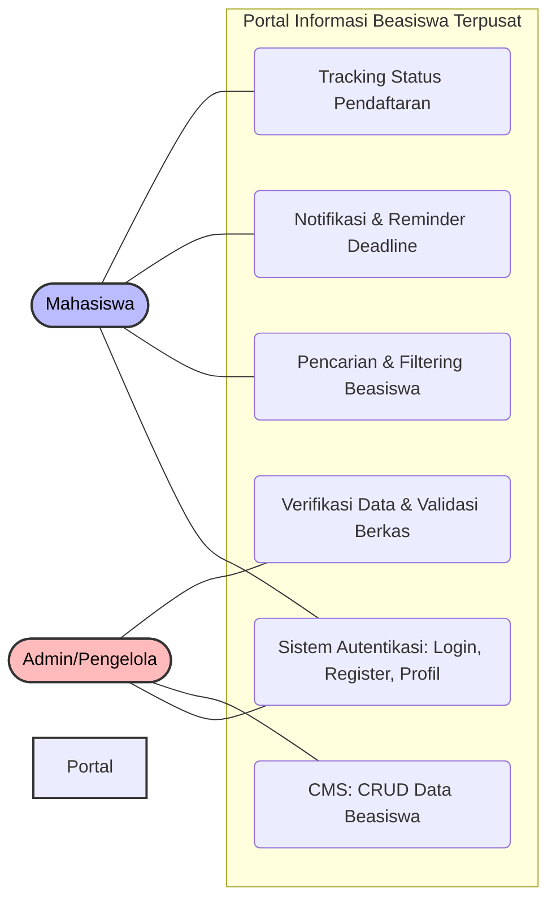
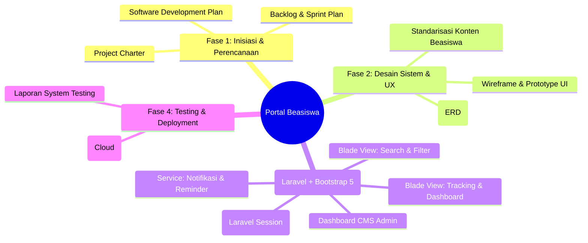
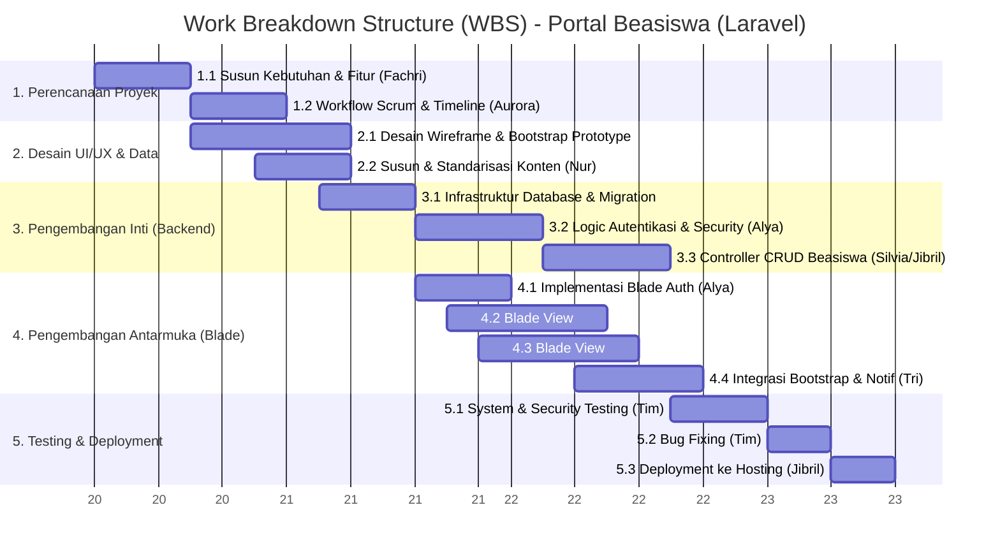

# TUGAS RESPONSI IV MANAJEMEN PROYEK
**Program Studi Teknik Informatika**

**Tujuan:** Mahasiswa mampu bekerja sama dalam mengidentifikasi, menganalisis, dan membuat *Software Development Plan*.
**Dosen Pengampu:** Venera Genia, S.S.I., M.T.I.

---

# Daftar Isi
- [Identitas Kelompok & Tabel Peran](#identitas-kelompok--tabel-peran)
- [Software Development Plan](#software-development-plan)
  - [1. Review MOV](#1-review-mov)
  - [2. Scope Definition](#2-scope-definition)
    - [2.1 Use Case Diagram](#21-use-case-diagram)
    - [2.2 Delivery Structure Chart (DSC)](#22-delivery-structure-chart-dsc)
  - [3. Work Breakdown Structure (WBS)](#3-work-breakdown-structure-wbs)

---

# Identitas Kelompok & Tabel Peran

**Identitas Kelompok:**
- **Nama Kelompok:** Bubur Sum-Scrum
- **Nomor Kelompok:** 2
- **Asdos Penanggung Jawab:** Nuranisah

**Tabel Peran:**

| NO | NIM | NAMA | Peran |
|:---:|:---|:---|:---|
| 1 | 0110224146 | Fachri Fadilah | Project Manager |
| 2 | 0110224057 | Aurora Zalfa Hartono | Scrum Master |
| 3 | 0110224170 | Eko Budi Prasetio | Media Creative (UI/UX) |
| 4 | 0110224199 | Nur Indah | Media Creative (Content) |
| 5 | 0110224002 | Jibril Ibrahim | Developer (Laravel Backend/Tracking) |
| 6 | 0110224019 | Silvia Zahrodiniah | Developer (Search & Blade Templating) |
| 7 | 0110224194 | Tri Nurjuliyanti | Developer (Notification & Bootstrap UI) |
| 8 | 0110224055 | Alya Dliya Zahra Andre | Developer (Auth & Security) |

---

# Software Development Plan

## 1. Review MOV
Berdasarkan dokumen *Project Charter* yang telah disepakati, *Measurable Organizational Value (MOV)* dari Proyek Pembangunan Website Portal Informasi Beasiswa Terpusat dirancang untuk memberikan dampak positif yang terukur, yaitu:

1. **Efisiensi Akses Informasi (Waktu):** Mengurangi waktu pencarian informasi beasiswa oleh mahasiswa hingga **50%** dalam 3 bulan pertama setelah implementasi sistem.
2. **Peningkatan Partisipasi:** Meningkatkan jumlah partisipasi pendaftaran beasiswa di lingkup internal kampus sebesar **30%** pada tahun pertama penggunaan sistem.
3. **Kualitas Layanan & UI/UX:** Mencapai tingkat kepuasan pengguna minimal dengan skor **4.0 dari skala 5.0** berdasarkan survei pengguna.
4. **Validasi & Akurasi Dokumen:** Menurunkan tingkat kesalahan atau ketidaklengkapan dokumen pendaftaran sebesar **40%** melalui fitur validasi pengunggahan berkas dalam sistem.

---

## 2. Scope Definition

### 2.1 Use Case Diagram
Berikut adalah diagram *Use Case* yang merepresentasikan *Product-Oriented Scope*, menunjukkan fungsionalitas sistem (modul utama) serta interaksi dari setiap aktor (Mahasiswa dan Admin):

### 2.2 Delivery Structure Chart (DSC)
*Delivery Structure Chart* (DSC) ini menjabarkan *Project-Oriented Scope* dengan merincikan hasil akhir (*deliverables*) yang wajib dihasilkan pada setiap fase pengerjaan proyek:

**Penjelasan Singkat DSC:**
- **Fase 1 (Inisiasi):** Difokuskan pada finalisasi dokumen manajerial proyek (*Charter, Plan, Timeline*).
- **Fase 2 (Desain):** Menghasilkan *blueprint* desain antarmuka menggunakan Bootstrap 5, skema basis data, dan struktur konten.
- **Fase 3 (Pengembangan):** Implementasi kode menggunakan Laravel 11 dengan templating Blade secara bertahap melalui metode iteratif (*Sprint*).
- **Fase 4 (Deployment):** Menjamin sistem diuji (UAT, keamanan) sebelum dirilis di infrastruktur *Cloud Hosting*.

---

## 3. Work Breakdown Structure (WBS)
Berikut adalah *Work Breakdown Structure* yang mendekomposisi seluruh paket pekerjaan pengembangan proyek menjadi rincian tugas (*tasks*) yang lebih terkelola dan spesifik.

### Rincian Hierarki WBS

**1. Fase Inisiasi & Perencanaan (Minggu 1)**
- 1.1 Perancangan sistem, penyusunan kebutuhan fitur utama (*Project Manager*)
- 1.2 Penyusunan *workflow* Scrum, *Daily Coordination*, penentuan *Backlog* & *Sprint Plan* (*Scrum Master*)

**2. Fase Desain & UI/UX (Minggu 1)**
- 2.1 Desain *Wireframe* & *Prototype* responsif menggunakan standar Bootstrap 5 (*Media Creative*)
- 2.2 Agregasi dan standarisasi konten informasi beasiswa (*Media Creative*)

**3. Fase Pengembangan Logika Bisnis & Database (Minggu 1 - 2)**
- 3.1 Pembangunan skema database menggunakan Laravel Migrations (*Developer*)
- 3.2 Implementasi Autentikasi Laravel (Session-based) dan proteksi CSRF (*Developer*)
- 3.3 Pembuatan Controller dan Model untuk fungsi CRUD Beasiswa (*Developer*)

**4. Fase Pengembangan Frontend (Blade & Bootstrap) (Minggu 2 - 3)**
- 4.1 Implementasi halaman Login, Register, dan Profil menggunakan Blade Templates (*Developer*)
- 4.2 Pengembangan sistem *Search & Filtering* dinamis dengan integrasi Controller-to-Blade (*Developer*)
- 4.3 Pembangunan antarmuka *Dashboard* untuk pelacakan (*Tracking Status*) menggunakan komponen Bootstrap 5 (*Developer*)
- 4.4 Integrasi sistem notifikasi email (Laravel Mail) dan pengingat *deadline* (*Developer*)

**5. Fase Pengujian & Deployment (Minggu 3)**
- 5.1 Pengujian fungsional sistem, validasi antarmuka Bootstrap, dan proteksi (XSS/SQLi) (*Tim*)
- 5.2 Evaluasi *feedback* dan perbaikan celah/bug sistem (*Tim*)
- 5.3 *Deployment* akhir aplikasi ke server *Cloud* dan manajemen *domain* (*Developer*)
