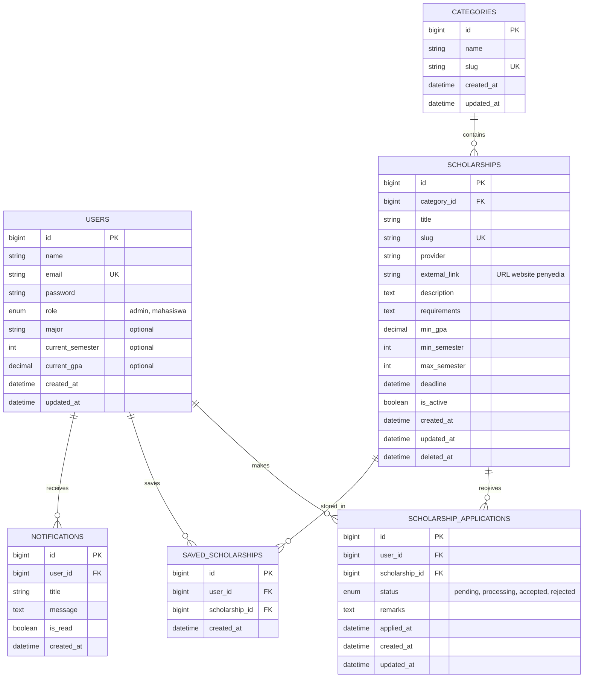

# Database Schema & Entity Relationship Diagram (ERD)
## Proyek Website Portal Informasi Beasiswa Terpusat

**Versi:** 1.0  
**Tanggal:** 6 Juni 2026  
**Database:** MySQL 8.0  

---

## 1. Entity Relationship Diagram (ERD)

Berikut adalah visualisasi hubungan antar entitas menggunakan notasi Mermaid:

---

## 2. Skema Tabel (Data Dictionary)

### 2.1 Tabel: `users`
Menyimpan data akun pengguna baik Mahasiswa maupun Admin.

| Column | Type | Constraints | Description |
|---|---|---|---|
| id | bigint | PK, Auto Increment | ID unik user. |
| name | varchar(255) | Not Null | Nama lengkap. |
| email | varchar(255) | Not Null, Unique | Alamat email (untuk login). |
| password | varchar(255) | Not Null | Hash password (Bcrypt). |
| role | enum | 'admin', 'mahasiswa' | Level akses pengguna. |
| major | varchar(100) | Nullable | Jurusan (untuk filter otomatis). |
| current_semester | int | Nullable | Semester saat ini. |
| current_gpa | decimal(3,2) | Nullable | IPK saat ini (e.g., 3.75). |

### 2.2 Tabel: `categories`
Kategori beasiswa (e.g., Prestasi, Bantuan Biaya, Luar Negeri).

| Column | Type | Constraints | Description |
|---|---|---|---|
| id | bigint | PK, Auto Increment | ID unik kategori. |
| name | varchar(100) | Not Null | Nama kategori. |
| slug | varchar(100) | Unique | URL friendly name. |

### 2.3 Tabel: `scholarships`
Data induk informasi beasiswa.

| Column | Type | Constraints | Description |
|---|---|---|---|
| id | bigint | PK, Auto Increment | ID unik beasiswa. |
| category_id | bigint | FK (categories.id) | Kategori terkait. |
| title | varchar(255) | Not Null | Judul beasiswa. |
| slug | varchar(255) | Unique, Index | URL friendly name untuk SEO. |
| provider | varchar(255) | Not Null | Penyelenggara. |
| min_gpa | decimal(3,2) | Default 0.00 | Syarat IPK minimal. |
| min_semester | int | Default 1 | Syarat semester minimal. |
| deadline | datetime | Not Null | Batas waktu pendaftaran. |
| is_active | boolean | Default True | Status publikasi. |

### 2.4 Tabel: `scholarship_applications` (Tracking)
Menyimpan riwayat pelacakan pendaftaran beasiswa mahasiswa.

| Column | Type | Constraints | Description |
|---|---|---|---|
| id | bigint | PK, Auto Increment | ID unik aplikasi. |
| user_id | bigint | FK (users.id) | Mahasiswa pendaftar. |
| scholarship_id | bigint | FK (scholarships.id) | Beasiswa yang didaftar. |
| status | enum | pending, processing, accepted, rejected | Status progres saat ini. |
| remarks | text | Nullable | Catatan/Alasan penolakan. |

---

## 3. Aturan Bisnis (Business Rules) Database
1. **Soft Deletes:** Tabel `scholarships` menggunakan *Soft Deletes* agar data yang dihapus tidak benar-benar hilang dari database histori pendaftaran.
2. **Indexing:** Kolom `slug`, `email`, dan `deadline` wajib diberi index untuk optimasi performa pencarian dan filter.
3. **On Delete Restrict:** Jika sebuah kategori memiliki data beasiswa, maka kategori tersebut tidak boleh dihapus (*Restrict*).
4. **Data Integrity:** Nilai `current_gpa` pada tabel `users` akan divalidasi silang dengan `min_gpa` pada tabel `scholarships` di level aplikasi.

