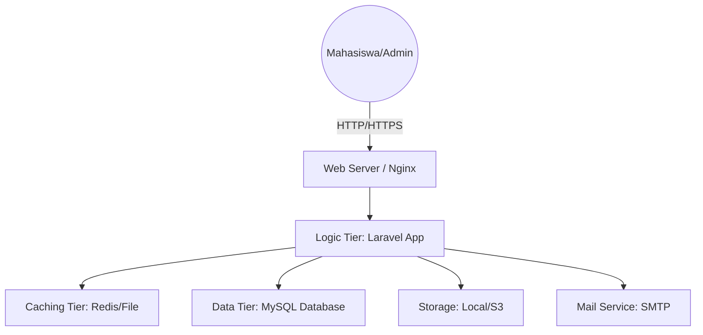
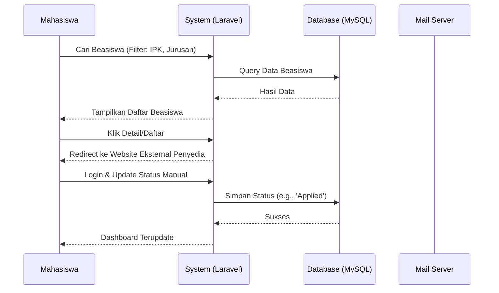

# System Architecture Design
## Proyek Website Portal Informasi Beasiswa Terpusat

**Versi:** 1.0  
**Tanggal:** 6 Juni 2026  
**Status:** Dokumen Desain Arsitektur

---

## 1. Pendahuluan
Dokumen ini menjelaskan struktur arsitektur sistem, komponen-komponen utama, serta aliran data dalam Portal Informasi Beasiswa Terpusat. Desain ini bertujuan untuk memastikan sistem yang dibangun bersifat *scalable*, *secure*, dan *maintainable*.

---

## 2. High-Level Architecture
Sistem menggunakan arsitektur **3-Tier** yang umum digunakan dalam aplikasi web modern berbasis Laravel:

### 2.1 Deskripsi Layer
1. **Presentation Layer:** Antarmuka berbasis web menggunakan Blade Templates & Bootstrap 5 yang dikelola oleh Laravel.
2. **Logic Layer (Application):** Framework Laravel mengelola *routing*, *middleware*, *business logic* (Services), dan *controller*.
3. **Data Layer:** MySQL sebagai database relasional untuk menyimpan data beasiswa, pengguna, dan riwayat pelacakan.

---

## 3. Komponen Sistem

### 3.1 Frontend (Presentation)
- **Blade Templates:** Engine templating bawaan Laravel untuk menyajikan data ke view.
- **Bootstrap 5:** Framework CSS utama untuk styling UI yang modern, responsif, dan konsisten.
- **Micro-animations:** Menggunakan Alpine.js atau Vanilla CSS Animations untuk interaksi UI premium.

### 3.2 Backend (Logic)
- **Laravel 11.x (PHP 8.2+):** Inti sistem pengelola logika bisnis.
- **Laravel Session:** Pengelola autentikasi berbasis sesi untuk aplikasi web.
- **Service & Repository Pattern:** Memisahkan logika bisnis untuk mematuhi prinsip SOLID.
- **Queues/Jobs:** Digunakan untuk pengiriman email notifikasi deadline secara *asynchronous* agar tidak membebani performa user.

### 3.3 Database (Data)
- **MySQL 8.0:** Penyimpanan data utama.
- **Migrations & Eloquent:** Standar pengelolaan database Laravel dengan dukungan Soft Deletes.

---

## 4. Data Flow Diagram (DFD) - Level 1

---

## 5. Security Architecture
Sistem menerapkan lapisan keamanan berlapis:
- **Authentication Middleware:** Memastikan akses fitur tertentu hanya untuk user yang ter-login.
- **CSRF Protection:** Melindungi aplikasi dari serangan *Cross-Site Request Forgery*.
- **XSS Filtering:** Laravel secara otomatis melakukan *escape* pada data yang ditampilkan di Blade.
- **Bcrypt Hashing:** Semua password di-hash secara permanen.
- **Rate Limiting:** Mencegah serangan *brute force* pada *endpoint* login.

---

## 6. Deployment Strategy
Sistem dirancang untuk di-deploy menggunakan:
- **Web Server:** Nginx.
- **Process Manager:** PHP-FPM.
- **SSL/TLS:** Let's Encrypt untuk enkripsi HTTPS.
- **CI/CD:** GitHub Actions untuk otomatisasi testing dan deployment ke server.
